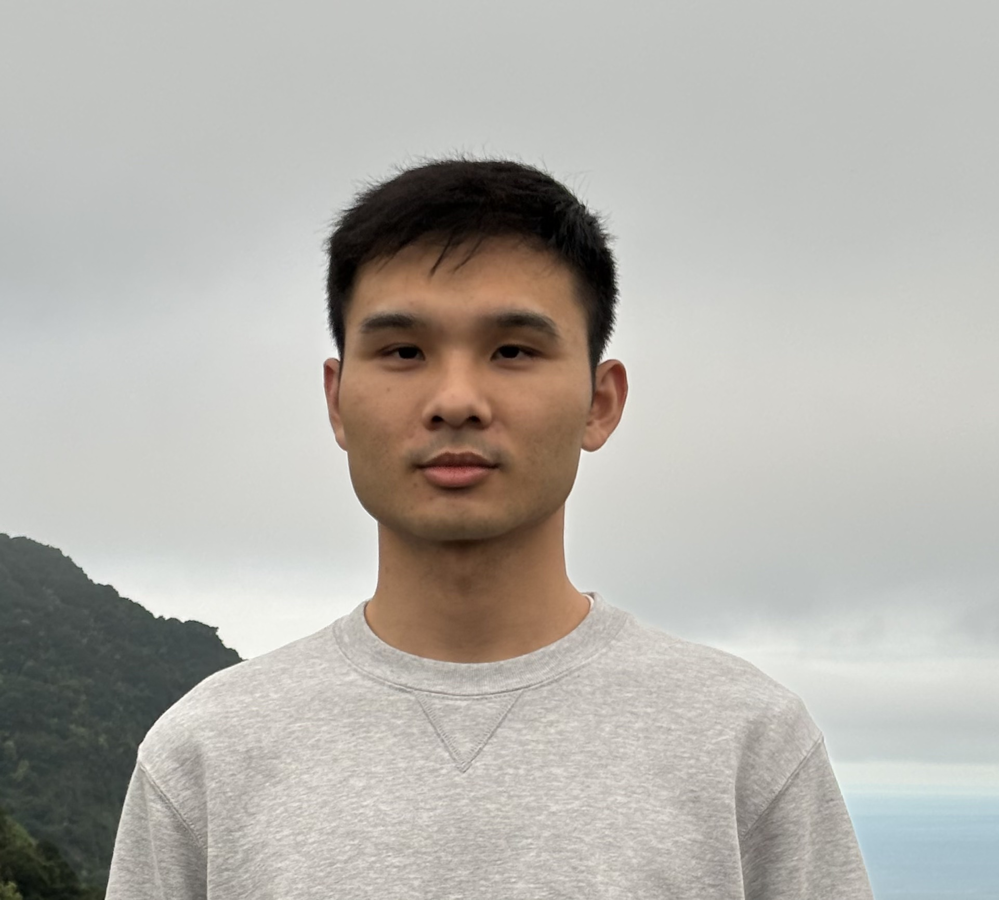

# Yifan Gao &nbsp; 高一帆

  

    
I am an Assistant Professor at the <a href="https://its.westlake.edu.cn/index.htm">Institute for Theoretical Sciences, Westlake University</a>. Before joining Westlake in 2025, I was a postdoc at City University of Hong Kong, hosted by <a href="https://www.cityu.edu.hk/stfprofile/bpmnolin.htm">Pierre Nolin</a> and <a href="https://qian.perso.math.cnrs.fr/">Wei Qian</a>. I received my Ph.D. from Peking University in 2022 under the supervision of <a href="http://faculty.bicmr.pku.edu.cn/~xinyili/">Xinyi Li</a> and <a href="https://www.math.pku.edu.cn/teachers/zhangfxi/eindex.htm">Fuxi Zhang</a>, and my B.S. from Sun Yat-sen University in 2017.

    
My research is in statistical physics and random geometry, with particular interests in the Gaussian free field, Brownian loop soups, percolation, and Schramm-Loewner evolution.

    
Email: gaoyifan75 at westlake dot edu dot cn

    
Address: No. 600 Dunyu Road, Xihu district, Hangzhou, Zhejiang Province, China, 310030 (浙江省杭州市西湖区墩余路600号, 310030)

    
Office: 303, E14 Research Center (E14科研中心303)

  

  

## Preprints
- **Generalized intersection exponents and local cut points for three-dimensional Brownian loop soup** Yifan Gao, Ruixuan Li, and Xinyi Li. [arXiv:2605.17494](https://arxiv.org/pdf/2605.17494), 24 pages.
- **One-arm probabilities for the two-dimensional metric-graph and discrete Gaussian free field** Yijie Bi, Yifan Gao, and Xinyi Li. [arXiv:2603.25400](https://arxiv.org/pdf/2603.25400), 24 pages.
- **Arm events in critical planar loop soups** Yijie Bi, Yifan Gao, Pierre Nolin, and Wei Qian. [arXiv:2509.25024](https://arxiv.org/abs/2509.25024), 20 pages, 3 figures.
- **Non-existence of several random fractals in the Brownian motion and the Brownian loop soup** Yifan Gao, Xinyi Li, Runsheng Liu, and Wei Qian. *Ann. Probab.* (to appear), [arXiv:2507.20324](https://arxiv.org/abs/2507.20324), 46 pages, 7 figures.
- **Up-to-constants estimates of four-arm events for simple conformal loop ensemble** Yifan Gao, Pierre Nolin, and Wei Qian. [arXiv:2504.06202](https://arxiv.org/abs/2504.06202), 36 pages, 12 figures.
- **A boundary Harnack principle and its application to analyticity of 3D Brownian intersection exponents** Yifan Gao, Xinyi Li, Yifan Li, Runsheng Liu, and Xiangyi Liu. [arXiv:2411.14921](https://arxiv.org/abs/2411.14921), 49 pages, 5 figures.
- **Percolation of discrete GFF in dimension two II. Connectivity properties of two-sided level sets** Yifan Gao, Pierre Nolin, and Wei Qian. [arXiv:2409.16273](https://arxiv.org/abs/2409.16273), 71 pages, 8 figures.
- **Percolation of discrete GFF in dimension two I. Arm events in the random walk loop soup** Yifan Gao, Pierre Nolin, and Wei Qian. [arXiv:2409.16230](https://arxiv.org/abs/2409.16230), 50 pages, 5 figures.

## Publications
- **Uniqueness of generalized conformal restriction measures and Malliavin-Kontsevich-Suhov measures for c∈(0,1]** Gefei Cai and Yifan Gao. *Ann. Probab.*, **54**(4):2149-2172, 2026. [Journal](https://projecteuclid.org/journals/annals-of-probability/volume-54/issue-4/Uniqueness-of-generalized-conformal-restriction-measures-and-MalliavinKontsevichSuhov-measures-for/10.1214/25-AOP1809.short), [arXiv:2502.05890](https://arxiv.org/abs/2502.05890)
- **Scaling limit of the occupation measure of random walk cut points** Yifan Gao, Xinyi Li, Petr Panov, and Daisuke Shiraishi. *Electron. J. Probab.*, **31**:1-63, 2026. [Journal](https://projecteuclid.org/journals/electronic-journal-of-probability/volume-31/issue-none/Scaling-limit-of-the-occupation-measure-of-random-walk-cut/10.1214/26-EJP1543.full), [arXiv:2310.09592](https://arxiv.org/abs/2310.09592)
- **Convergence in natural parametrization of random walk frontier** Yifan Gao, Xinyi Li, Runsheng Liu, Xiangyi Liu, and Daisuke Shiraishi. *Sci. China Math.*, **69**:1299-1330, 2026. [Journal](https://link.springer.com/article/10.1007/s11425-025-2470-2), [arXiv:2504.13743](https://arxiv.org/abs/2504.13743)
- **Multiple points on the boundaries of Brownian loop-soup clusters** Yifan Gao, Xinyi Li, and Wei Qian. *Ann. Probab.*, **54**(1):216-268, 2026. [Journal](https://projecteuclid.org/journals/annals-of-probability/volume-54/issue-1/Multiple-points-on-the-boundaries-of-Brownian-loop-soup-clusters/10.1214/25-AOP1765.short), [arXiv:2205.11468](https://arxiv.org/abs/2205.11468)
- **Sharp asymptotics for arm probabilities in critical planar percolation** Hang Du, Yifan Gao, Xinyi Li, and Zijie Zhuang. *Comm. Math. Phys.*, **405**(182), 2024. [Journal](https://link.springer.com/article/10.1007/s00220-024-05028-0), [arXiv:2205.15901](https://arxiv.org/abs/2205.15901)
- **On the chemical distance exponent for the two-sided level set of the two-dimensional Gaussian free field** Yifan Gao and Fuxi Zhang. *ALEA Lat. Am. J. Probab. Math. Stat.*, **19**(1):729-753, 2022. [Journal](https://alea.impa.br/articles/v19/19-28.pdf), [arXiv:2011.04955](https://arxiv.org/abs/2011.04955)

## Coauthors

Yijie Bi, [Gefei Cai](https://gefei-cai.github.io/), [Hang Du](https://hangdu2000.github.io/MyHomePage/), Ruixuan Li, [Xinyi Li](http://faculty.bicmr.pku.edu.cn/~xinyili/), Yifan Li, Runsheng Liu, Xiangyi Liu, [Pierre Nolin](https://www.cityu.edu.hk/stfprofile/bpmnolin.htm), Petr Panov, [Wei Qian](https://qian.perso.math.cnrs.fr/), [Daisuke Shiraishi](https://kdb.iimc.kyoto-u.ac.jp/profile/en.f6a26c885ba820ce.html), [Fuxi Zhang](https://www.math.pku.edu.cn/teachers/zhangfxi/eindex.htm), [Zijie Zhuang](https://zijie123123.github.io/).

## Talks
- Jul 2025: The 44th Conference on Stochastic Processes and their Applications, Wrocław, Poland
- Jun 2025: The 9th National Conference on Probability Theory, Changsha
- May 2025: First Math Workshop of CityUHK and the University of Edinburgh, CityU, Hong Kong
- May 2025: Third China-Japan-Korea Joint Probability Workshop, RIMS, Kyoto University
- Feb 2025: Percolation Today (online): Percolation of discrete GFF in dimension two
- Dec 2024: Geometry of Random Fields and Random Walk Clusters: New Horizons, [report](Files/Ober_report.pdf), MFO, Germany
- Dec 2024: Youth Probability Forum, Beijing Normal University at Zhuhai
- Dec 2023: Random Interacting Systems, Scaling Limits, and Universality, National University of Singapore
- Jun 2023: Discrete Probability and Related Problems, Sichuan University
- Feb 2023: Hong Kong Probability Seminar, HKUST
- Apr 2022: THU-PKU-BNU Joint Probability Webinar (online)
- Jan 2022: Probability Seminar (online), Universität zu Köln
- Oct 2021: The First International Conference for Chinese Young Probability Scholars, Hunan

## Links
- My [CV](Files/CV.pdf)
- Past [student seminars](Files/seminars.html)
- My [Google scholar](https://scholar.google.com/citations?user=ppG-FbgAAAAJ&hl=en)
