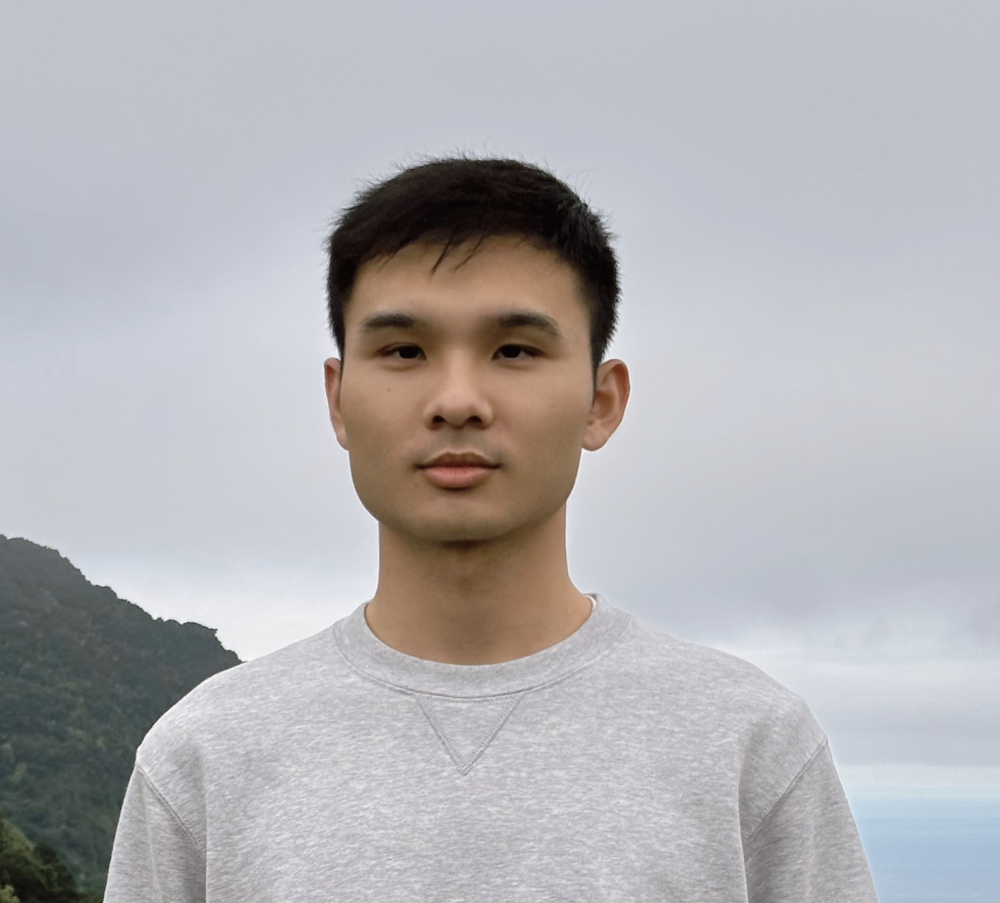

# GAO Yifan &nbsp; 高一帆

- I am currently a Postdoc at [Department of Mathematics, City University of Hong Kong](https://www.cityu.edu.hk/ma/), working with [Pierre Nolin](https://www.cityu.edu.hk/stfprofile/bpmnolin.htm) and [Wei Qian](https://qian.perso.math.cnrs.fr/).
- My research interest is probability theory, with a focus on 2D random conformally invariant objects: Gaussian free field, Brownian loop soup, and percolation.
- Email: yifangao at cityu dot edu dot hk
- My [Google scholar](https://scholar.google.com/citations?user=ppG-FbgAAAAJ&hl=en)

## Curriculum Vita

- 2022 -  &emsp;&emsp;&ensp;&ensp; Postdoc at City University of Hong Kong
- 2017 - 2022 &nbsp;&nbsp; PhD at Peking University under the supervision of [Fuxi Zhang](https://www.math.pku.edu.cn/teachers/zhangfxi/eindex.htm) and [Xinyi Li](http://faculty.bicmr.pku.edu.cn/~xinyili/)
- 2013 - 2017 &nbsp;&nbsp; B.S. at Sun Yat-sen University

## Works

- Uniqueness of generalized conformal restriction measures and Malliavin-Kontsevich-Suhov measures for c∈(0,1] (with G. Cai). [arXiv](https://arxiv.org/abs/2502.05890), 20 pages.
- A boundary Harnack principle and its application to analyticity of 3D Brownian intersection exponents (with X. Li, Y. Li, R. Liu and X Liu). [arXiv](https://arxiv.org/abs/2411.14921), 49 pages, 5 figures.
- Percolation of discrete GFF in dimension two II. Connectivity properties of two-sided level sets (with P. Nolin and W. Qian). [arXiv](https://arxiv.org/abs/2409.16273), 71 pages, 8 figures.
- Percolation of discrete GFF in dimension two I. Arm events in the random walk loop soup (with P. Nolin and W. Qian). [arXiv](https://arxiv.org/abs/2409.16230), 50 pages, 5 figures.
- Scaling limit of the occupation measure of random walk cut points (with X. Li, P. Panov and D. Shiraishi). [arXiv](https://arxiv.org/abs/2310.09592), 57 pages, 12 figures.
- Multiple points on the boundaries of Brownian loop-soup clusters (with X. Li and W. Qian). *Ann. Probab.* (to appear), [arXiv](https://arxiv.org/abs/2205.11468), 55 pages, 12 figures. 
- Sharp asymptotics for arm probabilities in critical planar percolation (with H. Du, X. Li and Z. Zhuang). *Comm. Math. Phys.*, **405**(182), 2024. [arXiv](https://arxiv.org/abs/2205.15901)
- On the chemical distance exponent for the two-sided level set of the two-dimensional Gaussian free field (with F. Zhang). *ALEA Lat. Am. J. Probab. Math. Stat.*, **19**(1):729-753, 2022. [arXiv](https://arxiv.org/abs/2011.04955)

## In preparation

- Arm exponents in CLE and the Brownian loop soup (with P. Nolin and W. Qian).
- On the non-existence of several random fractals of zero dimension derived from Brownian motion (with X. Li, R. Liu and W. Qian). 
- Convergence of the frontier of planar random walk in natural parametrization (with X. Li, R. Liu, X. Liu and D. Shiraishi).

## Coauthors

[Gefei Cai](https://gefei-cai.github.io/), [Hang Du](https://hangdu2000.github.io/MyHomePage/), [Xinyi Li](http://faculty.bicmr.pku.edu.cn/~xinyili/), Yifan Li, Runsheng Liu, Xiangyi Liu, [Pierre Nolin](https://www.cityu.edu.hk/stfprofile/bpmnolin.htm), Petr Panov, [Wei Qian](https://qian.perso.math.cnrs.fr/), [Daisuke Shiraishi](https://kdb.iimc.kyoto-u.ac.jp/profile/en.f6a26c885ba820ce.html), [Fuxi Zhang](https://www.math.pku.edu.cn/teachers/zhangfxi/eindex.htm), [Zijie Zhuang](https://zijie123123.github.io/).

## Talks

- Feb 2025: Percolation Today (online): Percolation of discrete GFF in dimension two
- Dec 2024: Geometry of Random Fields and Random Walk Clusters: New Horizons, MFO, Germany
- Dec 2024: Youth Probability Forum, Beijing Normal University at Zhuhai
- Dec 2023: Random Interacting Systems, Scaling Limits, and Universality, National University of Singapore
- Jun 2023: Discrete Probability and Related Problems, Sichuan University
- Feb 2023: Hong Kong Probability Seminar, HKUST
- Apr 2022: THU-PKU-BNU Joint Probability Webinar (online)
- Jan 2022: Probability Seminar (online), Universität zu Köln
- Oct 2021: The First International Conference for Chinese Young Probability Scholars, Hunan

## Links
- My [CV](Files/CV.pdf)
- Past [student seminars](Files/seminars.html)
- A joint [Hong Kong Probability Seminar](https://sites.google.com/site/hkprobability/)

